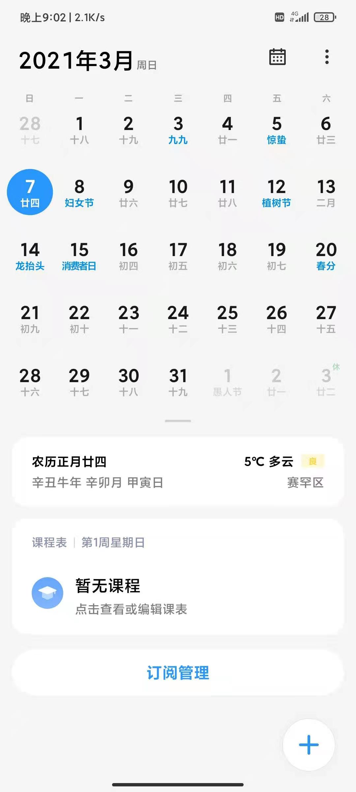
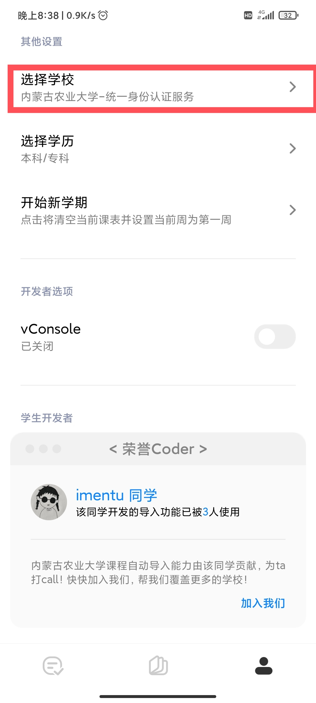
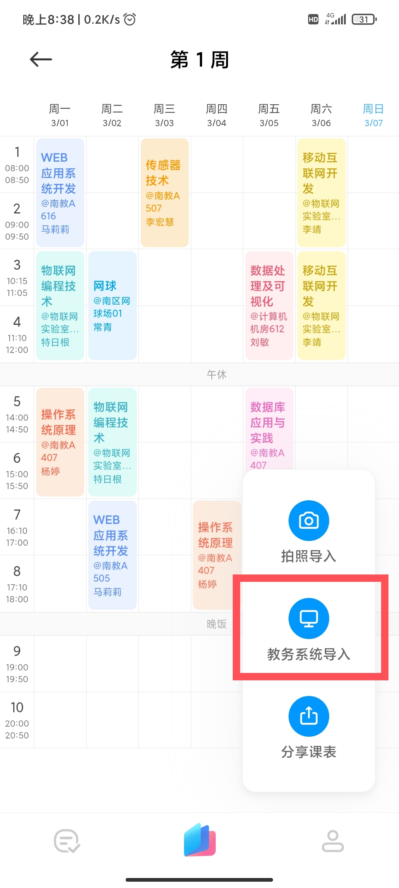
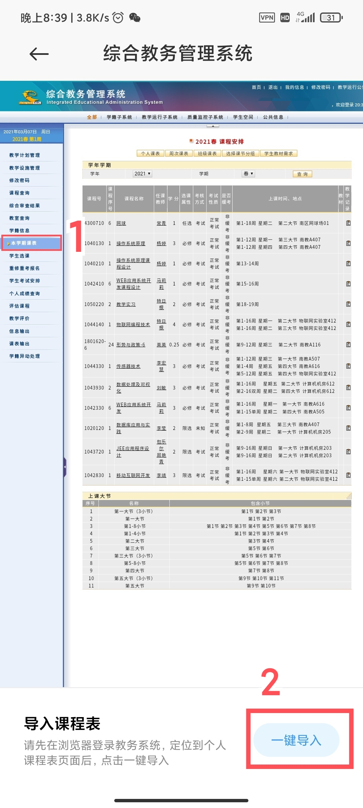

# AISchedule-IMAU

为小爱课程表适配内蒙古农业大学教务系统（通过统一身份认证服务登录）。

## TODO

- [ ] 自动适配教学作息时间

- [ ] 提升代码质量

## 使用方式

- MIUI 系统日历中订阅课程表服务并打开。
    

- 设置中选择学校：内蒙古农业大学-统一身份认证服务。
    

- 课表页点击教务系统导入。
    

- 登录后打开教务系统点击个人课表并点击一键导入。
    

## 最后

如果在使用中发现 bug 或有对于 feature 的建议，可以提出 issue。